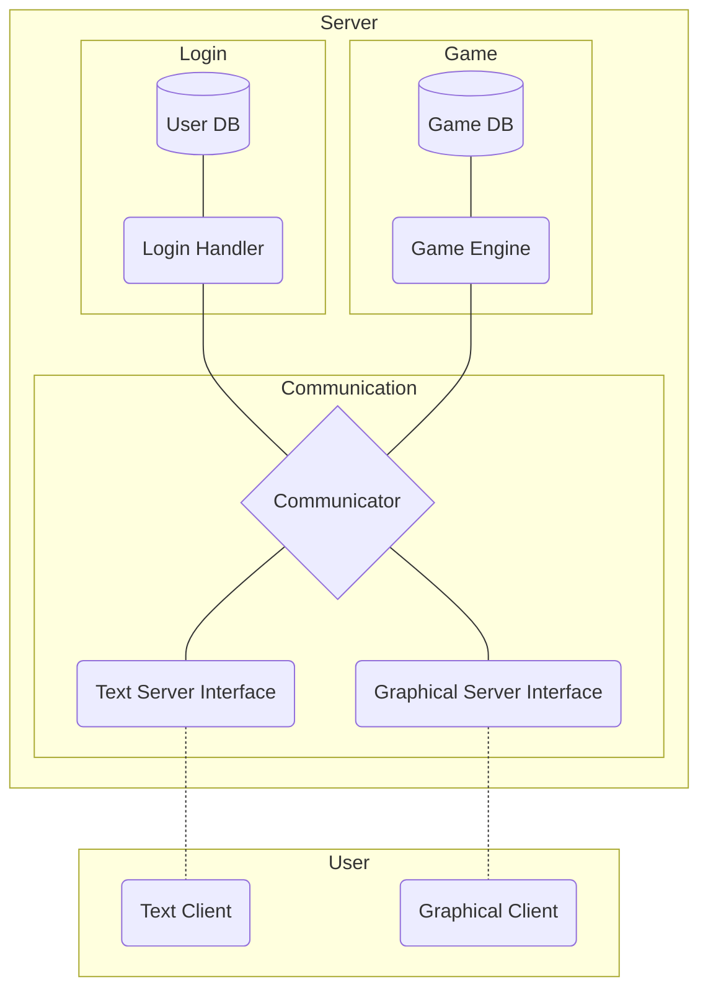

# Modules Description
## Introduction
This document's purpose is to clarify how the server should work and be implemented, being adapted as work gets done.

## Communication
### Communicator
Module responsible for receiving and sending data to user. It should be able to handle new communications, triggering Login Handler, and maintain them once logged, interacting with Game Engine - capturing a shot of its current state and sending to the user, when required - and feeding it with new information coming from said user. It is planned to have a dedicated thread for every user.

### Text Server Interface
Responsible for translating the game data captured from the Game Engine, formatting accordingly to the text interface and sending it to the user, using Telnet(?) protocol.

### Graphical Server Interface
Responsible for translating the game data captured from the Game Engine, formatting accordingly to the graphical interface and sending it to the user, using UDP(?) protocol.

## Game
### Game Engine
Where the actual game takes place. It should be able to receive user input by Communicator, process it and send it back to the Communicator module. It keeps its data stored Game DB.

### Game DB
Maps, enemies, characters, state of the world is stored here.

## Login
### User DB
Database for login information, like username, password and mail.

### Login Handler
Module to handle login. Security measures should be implemented here, as to prevent SQL injections or brute force attempts to discover passwords.
