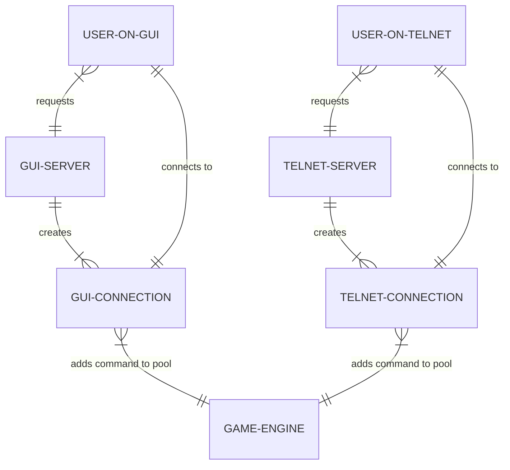

# Modules Description
## Introduction
This document's purpose is to clarify how the server should work and be implemented, being adapted as work gets done.

Obs: each node _should_ represent a class, instead when said otherwise.

## Description
### USER-ON-[CLIENT]
User requesting a connection to **[CLIENT]-SERVER** through a GUI or Telnet client.

### [CLIENT]-SERVER
An object responsible for creating new **[CLIENT]-CONNECTION** objects.

### [CLIENT]-CONNECTION
Object responsible for receiving data from **USER-ON-[CLIENT]** and translating it to issue commands to **PLAYER-ENTITY**. Also receives data from **PLAYER-ENTITY** and translates it accordingly to [CLIENT], sending it to **USER-ON-[CLIENT]**. Additionally, it's responsible for requesting **PLAYER-ENTITY** to **GAME-ENGINE**.

### GAME-ENGINE
Responsible for creating, transforming and deleting entities. Also manages locations.

#### PLAYER-ENTITY
Object representing user's character. It can interact with **LOCATION** and **ENTITY**. It's managed by **GAME-ENGINE** and it's also an **ENTITY**.

#### ENTITY
An Object that represents a creature or item.
